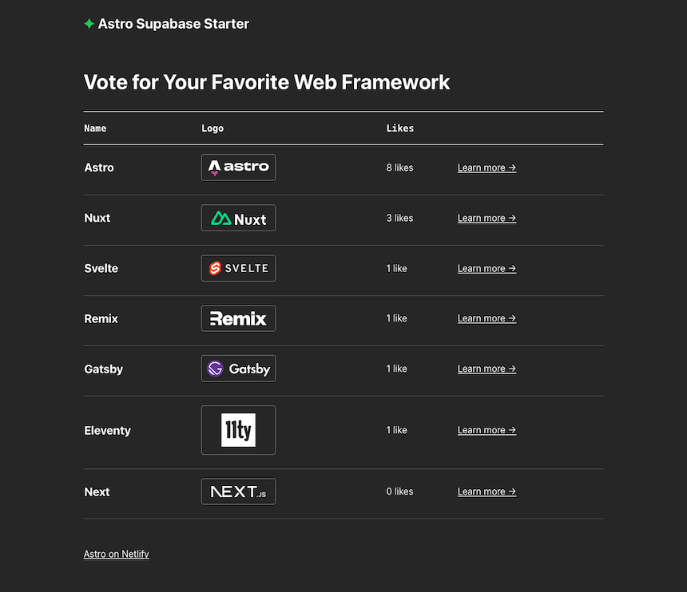

# Astro Netlify DB Starter



The Astro Netlify DB starter demonstrates how to integrate **Netlify DB** (powered by Neon) into an Astro project deployed on Netlify.

## Features

- **Netlify DB Integration**: Seamless, passwordless Postgres database.
- **Astro**: Fast, content-focused web framework.
- **Auto-Seeding**: Automatically creates and seeds the database with initial data.
- **CRUD Operations**: List, Like (Update), and Add (Create) web frameworks.

## Deploying to Netlify

If you click "Deploy to Netlify" button, it will create a new repo for you that looks exactly like this one, and sets that repo up immediately for deployment on Netlify.

[](https://app.netlify.com/start/deploy?repository=https://github.com/askforkris90/astro-supabase-starter&fullConfiguration=true)

## Astro Commands

All commands are run from the root of the project, from a terminal:

| Command                   | Action                                           |
| :------------------------ | :----------------------------------------------- |
| `npm install`             | Installs dependencies                            |
| `npm run dev`             | Starts local dev server at `localhost:4321`      |
| `npm run build`           | Build your production site to `./dist/`          |
| `npm run preview`         | Preview your build locally, before deploying     |
| `npm run astro ...`       | Run CLI commands like `astro add`, `astro check` |
| `npm run astro -- --help` | Get help using the Astro CLI                     |

## Developing Locally

| Prerequisites                                                                |
| :--------------------------------------------------------------------------- |
| [Node.js](https://nodejs.org/) v18.14+                                       |
| (optional) [nvm](https://github.com/nvm-sh/nvm) for Node version management  |
| [Netlify account](https://netlify.com/)                                      |
| [Netlify CLI](https://docs.netlify.com/cli/get-started/).                    |

### Set up the database

To use this template with Netlify DB, you simply need to initialize it via the Netlify CLI.

1. Link your local repository to a Netlify site: `netlify link`
2. Initialize the database: `netlify db init`
3. The application will automatically create and seed the `frameworks` table on its first run.

### Install and run locally

1. Clone this repository, then run `npm install` in its root directory.

2. Run the Astro.js development server via Netlify CLI:

```
netlify dev
```

If your browser doesn't navigate to the site automatically, visit [localhost:8888](http://localhost:8888).

## Support

If you get stuck along the way, get help in our [support forums](https://answers.netlify.com/).
